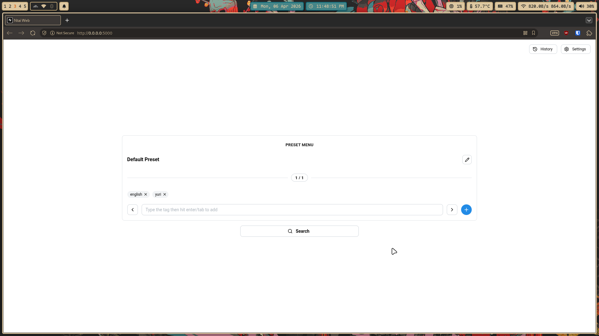
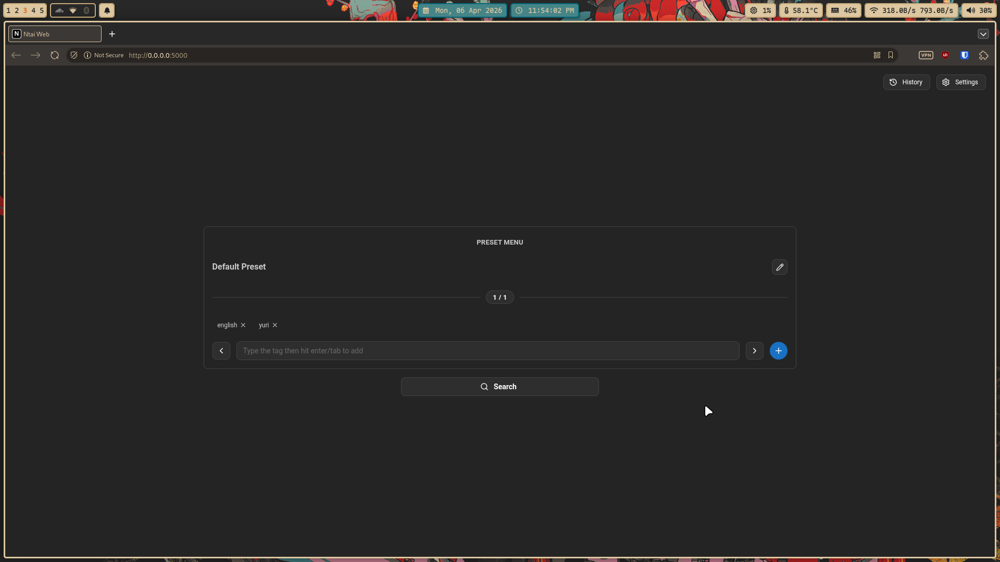
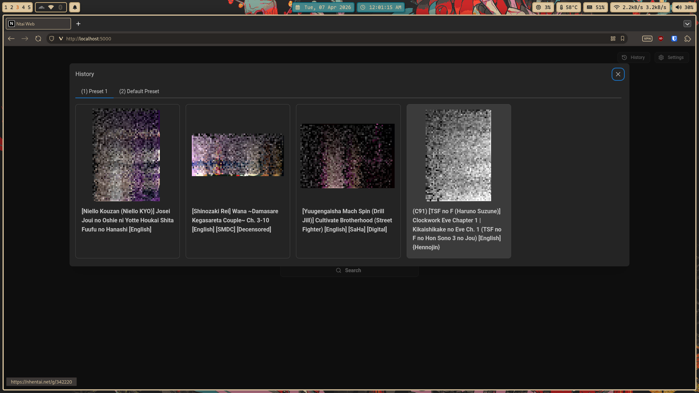
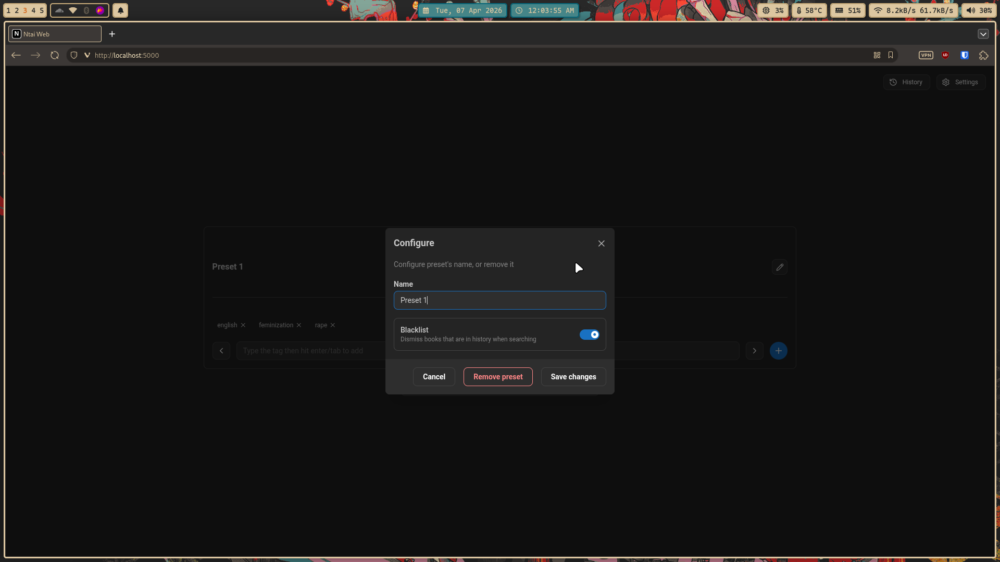

# Ntai
Ntai is the successor to [Firush](https://github.com/eeriemyxi/firush) that uses
the new [nHentai API](https://nhentai.net/api/v2/docs) instead.

Firush was a tool to find _random_ manga/doujinshi/comics from [nHentai](https://nhentai.net) based on
search queries.

Firush behind the scenes was doing the following:
- Search the query
- Scrape the total page count _k_ 
- Pick a random number between 1 and _k_
- Scrape and return a random entry from that page.

However, nHentai has now made scraping the site unreliable; thus, Ntai depends
on the API instead for the page count and book information.

# Screenshots
## Web Client

  
Click to expand additional screenshots

  
  

